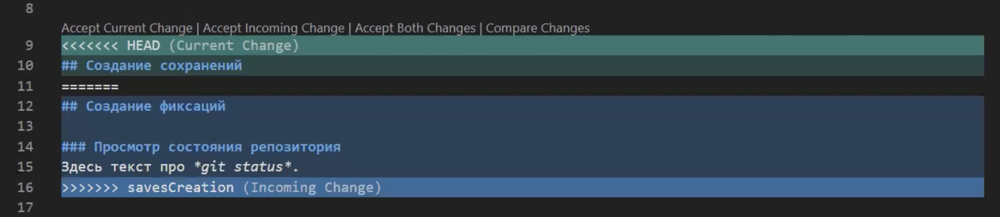
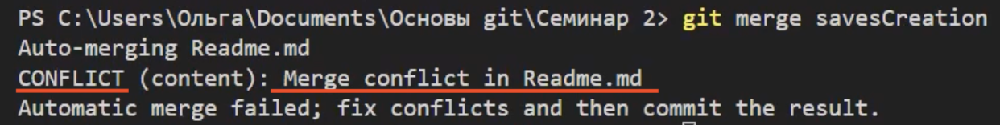
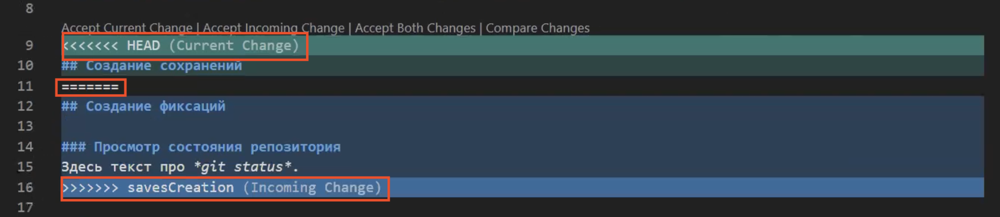
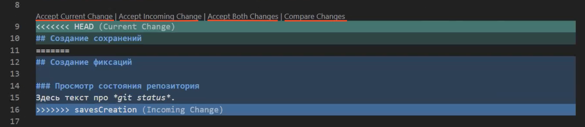

# Инструкциия по работе с Git

## Что такое git?
Git - одна из реализаций распределлённых систем контроля версий, что позволяет иметь версионность как в локальном репозитории, так и в удалённом(общим для всех). Git является самой популярной системой контроля версий на данный момент.

## Подготовка репозитория
Для создания репозитория используется комманда _**git init**_. Чтобы папка стала репозиторием достаточно написать в терминале _**git init**_.

## Создание коммитов

### Просмотр состояния репозитория 
Посмотреть текущее состояние репозитория и что **git** об этом "думает" можно с помощью команды **_git status_**.

### Добавление файла в коммит
Для добовление файла в текущий коммит используется комманда **_git add_**. Для добавления достаточно в терминале с папкой текущего репозитория написать **_git add <название файла>_**.

### Сохранение коммита
Для сохранения коммита используется комманда **_git commit_**. Для сохранения необходимо в терминале с папкой текущего репозитория написать **_git commit -m <Сообщение к коммиту>_**. Сообщение к коммиту писать _**ОБЯЗАТЕЛЬНО!!!**_

## Журнал изменений
Для просмотра истории коммитов (т.е. истории наших изменений) используется команда _**git log**_. Для просмотра истории коммитов достаточно в терминале с папкой-репозиторием написать команду _**git log**_.

## Перемещение между коммитами
Для того, чтобы "перемещаться" между коммитами необходимо использовать команду _**git checkout**_. Для "перемещения" между коммитами достаточно в терминале с папкой текущего репозитория написать **_git checkout <номер коммита>_**. _Номер коммита_ можно узнать в истории (журнале) изменений! После такого "перемещения" мы поподаем в состояние **_Detached head_**. Для возвращения в обычное состояние используется команда **_git checkout master_**.

## Ветки в Git

### Что такое ветки в Git?
__Ветка__ в _**Git**_ это подвижный указатель на один из **коммитов**. Обычно _ветка_ указывает на последний **коммит** в **_цепочке коммитов_**. По умолчанию, имя основной **ветки** в _**Git**_ — **master**.

Примечание:
>_Ветка_ **«master»** в _**Git**_ — это не какая-то особенная _ветка_. Она точно такая же, как и все остальные _ветки_. Она существует почти во всех _репозиториях_ только лишь потому, что её создаёт команда _**git init**_, а большинство людей не меняют её название.

### Просмотр всех доступных веток
Для просмотра всех доступных веток используется команда _**git branch**_. Для просмотра всех доступных веток достаточно в терминале с папкой-репозиторием написать команду _**git branch**_.

## Слияние веток и решение конфликтов

<<<<<<< HEAD
### Слияние веток
Чтобы слить (соединить воедино) две ветки используется команда **_git merge <название ветки с которой хотите слить текущую>_**. Для соединения веток достаточно в терминале с папкой текущего репозитория написать **_git merge <название ветки с которой хотите слить текущую>_**.

Примечание:
>**ВНИМАНИЕ!** Писать команду **_git merge <название ветки>_** нужно находясь в ветку в которую вы хотите слить (перенести изменения) другую, например, чтобы слить ветку **exemple** в ветку **master** нужно написать команду **_git merge exemple_**, НАХОДЯСЬ В ВЕТКЕ **master**!

### Решение конфликтов
Иногда, при слиянии веток, могут появляться **конфликты**.
**Конфликт** возникает когда **git** видит несколько вариантов одной и той же строки. **Git** не может определить за человека какой вариант более правильный, поэтому он оставляет эту работу для него.

Решить **конфликт** можно **вручную** (рекомендую) или **выбрав из какого источника вставить строку**.

### Пример конфликта

Данный конфликт произошёл в результате слияния двух веток - **master** и **savesCreation**!

Вот, что появляется в терминале:

Но **не** стоит **волноваться** это бывает очень часто!)

У нас есть 2 пути решения *конфликта*, как сказано выше, это решить **вручную** или **автоматически**.

### Решение вручную (рекомендую)
Для решения **вручную** нам надо всего лишь **стререть** все **строки**, обведённые красным прямоугольником:

А после - удалить всё ненужное и оставить нужное, потом **не забудьте** сделать **коммит**, чтобы сохранить изменения! :)

### Решение автоматически (НЕ рекомендую)
Для решения **автоматически** нам нужно нажать на одну из **кнопок**, подчеркнутых красной линией:

Вот, что означает каждая кнопка:

1. **Accept Current Change** - Принять Текущее Изменение (т.е. принять вариант, который находится в той же ветке, что и вы сейчас, в данном случае - ветка **master**, другой вариат **удалится**)

2. **Accept Incoming Change** - Принять Входящее Изменение (т.е. принять вариант, который находится ветке, которую вы сейчас присоединяете, в данном случае - ветка **savesCreation**, другой вариант **удалится**)

3. **Accept Both Changes** - Принять Оба Изменения (т.е. принять оба варианта из обеих веток, так сохранится сразу 2 варианта текста друг-под-другом в данном случае - вариант ветки **master**, а под ним вариант ветки **savesCreation**)

4. **Compare Changes** - Сравнить Изменения (т.е. сравнить оба варианта из обеих веток дуг с другом, так можно наглядно увидеть различия между 2 вариантами текста, в данном случае - вариант ветки **master** и вариант ветки **savesCreation**)

## Удаление веток
=======
## Удаление веток
Для удаления ветки используется комманда **_git branch -d <название ветки>_**. Для удаления ветки необходимо в терминале с папкой текущего репозитория написать **_git branch -d <название ветки>_**.
>>>>>>> deleteBranches
